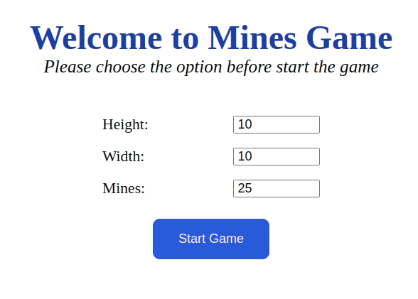
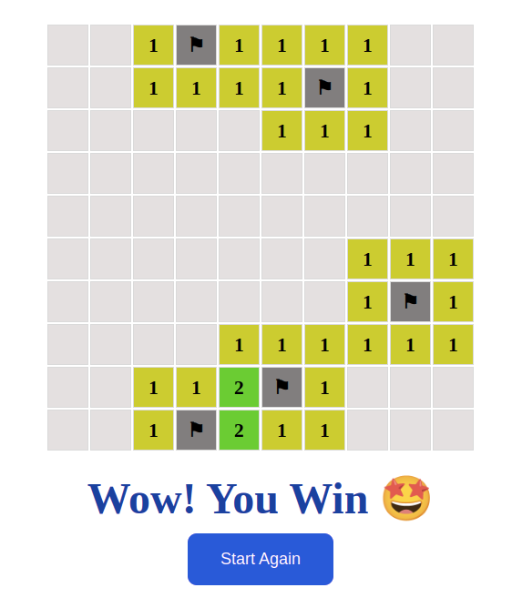
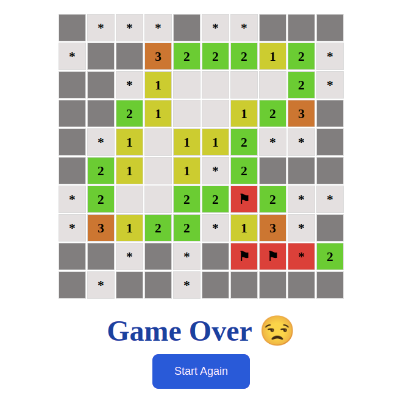

<br />

<br />

<br />

## Mines 


## Rule of game:
1. Start by choosing one of the three default board sizes, or by selecting a custom board;
2. The game begins with the board covered in tiles. Click on any tile to uncover it;
3. A colored number, which represent the number of mines in the adjacent tiles. This will help you deduce where the mines are so that you can mark them with flags;
4. A blank tile, which means there are no mines under any of the adjacent tile;
5. Repeat the previous step until you have uncovered all the tiles which do not have mines underneath them;
6. A mine, which will detonate and end the game.


## Install
You can install this game on your PC and run it using npm

```sh
npm init
```

```sh
npm start
```

Don't forget install live-server, if you haven't it
```sh
npm install -g live-server
```

## Demo
<a href='https://soltonanna.github.io/mines_game/' target='_blank'>DEMO</a>